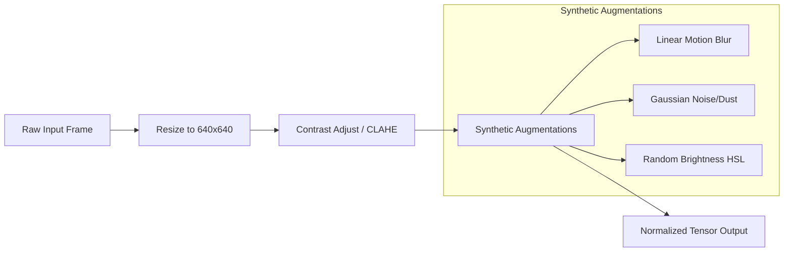

# Phase 1 & 2: Dataset Acquisition, Preprocessing, and YOLO Object Detection
**Responsible Lead: Do Duy Loi (23120293)**

---

## 📋 Phase Objectives
- Source and preprocess diverse industrial datasets (MVTec D2S, Roboflow custom).
- Apply advanced image augmentations to simulate conveyor belt environments (unstable lighting, motion blur, dust).
- Train, evaluate, and benchmark YOLOv8 and YOLOv11 detection models to achieve $>95\%$ mAP@0.5 and $<10$ ms latency (raw PyTorch).

---

## 1. Dataset Selection & Management

### 📂 Datasets to be Integrated
1. **MVTec D2S (Densely Segmented Images)**:
   - **Purpose**: Ideal for pre-training and testing high-density, multi-category industrial product counting.
   - **Attributes**: Contains 21,000 high-resolution images of retail items in typical grocery environments. Includes severe occlusion and varying orientations.
   - **Source**: [MVTec D2S Dataset](https://www.mvtec.com/company/research/datasets/d2s/).
2. **Roboflow Custom Dataset**:
   - **Purpose**: Domain adaptation for the specific conveyor line products (bottles, cartons, mechanical parts).
   - **Curation**: Capture 500-1000 frames from real/simulated conveyor belt feeds.
   - **Labeling**: Utilize Roboflow standard bounding box tools to annotate product bounding boxes.

### 🗂️ YOLO Dataset Directory Layout
```text
data/
├── train/
│   ├── images/   # Training frames
│   └── labels/   # YOLO format annotation txt files (class x_center y_center width height)
├── val/
│   ├── images/   # Validation frames
│   └── labels/   # Validation txt annotations
└── test/
    ├── images/   # Unseen test frames
    └── labels/   # Test txt annotations
```

---

## 2. Preprocessing & Advanced Augmentations

To combat the technical challenges outlined in the proposal (motion blur, lighting variance, dust), the preprocessing pipeline will implement:



### 🛠️ Augmentation Implementation Matrix
- **CLAHE (Contrast Limited Adaptive Histogram Equalization)**: Normalizes lighting variations across different sections of the conveyor belt.
- **Linear Motion Blur**: Simulates high-speed movement of products on the conveyor belt.
- **Random Gaussian Noise & Dust Emulation**: Replicates camera lens dust accumulation and sensor noise in harsh factory environments.
- **Mosaic & Mixup**: Utilized during YOLO training to improve small product detection and dense overlap scenarios.

---

## 3. YOLOv8 / YOLOv11 Training Roadmap

### 🔬 Architecture Comparison Matrix
We will train and compare two primary models to choose the best speed-accuracy trade-off:

| Model Configuration | Param Size | Ideal Use Case | Pros | Cons |
| :--- | :--- | :--- | :--- | :--- |
| **YOLOv8-Small (s)** | 11.2M | Jetson Nano Edge | Fast inference, lightweight footprint | Slightly lower recall under high density |
| **YOLOv11-Medium (m)** | ~20M | Jetson Xavier / PC | State-of-the-art accuracy, robust tracking features | Higher computational overhead |

### ⚙️ Training Parameters Configuration (`args.yaml`)
```yaml
model: yolov11m.pt  # or yolov8s.pt
epochs: 150
imgsz: 640
batch: 16
device: 0            # GPU ID
optimizer: AdamW
lr0: 0.01
lrf: 0.01
momentum: 0.937
weight_decay: 0.0005
warmup_epochs: 3.0
close_mosaic: 10     # Turn off mosaic for the last 10 epochs for finer boundary tuning
```

---

## 📈 Evaluation & Validation Metrics

The trained models will be benchmarked on the validation dataset using:
1. **mAP@0.5**: Primary metric for bounding box accuracy (Target: $>95\%$).
2. **mAP@0.5:0.95**: Standard evaluation metric for high-precision bounding box overlap.
3. **Precision & Recall Curves**: Analyzed to set the optimal confidence threshold to eliminate false positives while avoiding missed products.
4. **Latency Profile**: Measured in milliseconds per frame (Pre-processing + Model Inference + Post-processing).

---

## 🗺️ Actionable Task List

- [ ] **Task 1.1**: Set up dataset directories and download the MVTec D2S subset.
- [ ] **Task 1.2**: Record and extract custom conveyor belt product frames (500 images) and upload to Roboflow.
- [ ] **Task 1.3**: Annotate objects in Roboflow, review annotations, and export in YOLOv8/v11 text format.
- [ ] **Task 1.4**: Write `src/dataset_utils.py` containing custom Albumentations pipeline (Motion blur, CLAHE, dust injection).
- [ ] **Task 1.5**: Set up Ultralytics training environment, configure `data.yaml`, and run YOLOv8s baseline.
- [ ] **Task 1.6**: Run YOLOv11m training with identical parameters.
- [ ] **Task 1.7**: Generate comparative validation reports (mAP, Precision, Recall, Latency) and export models to ONNX.
