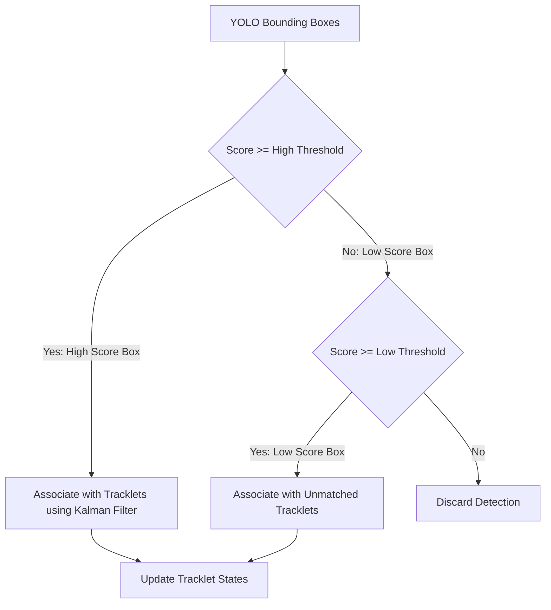
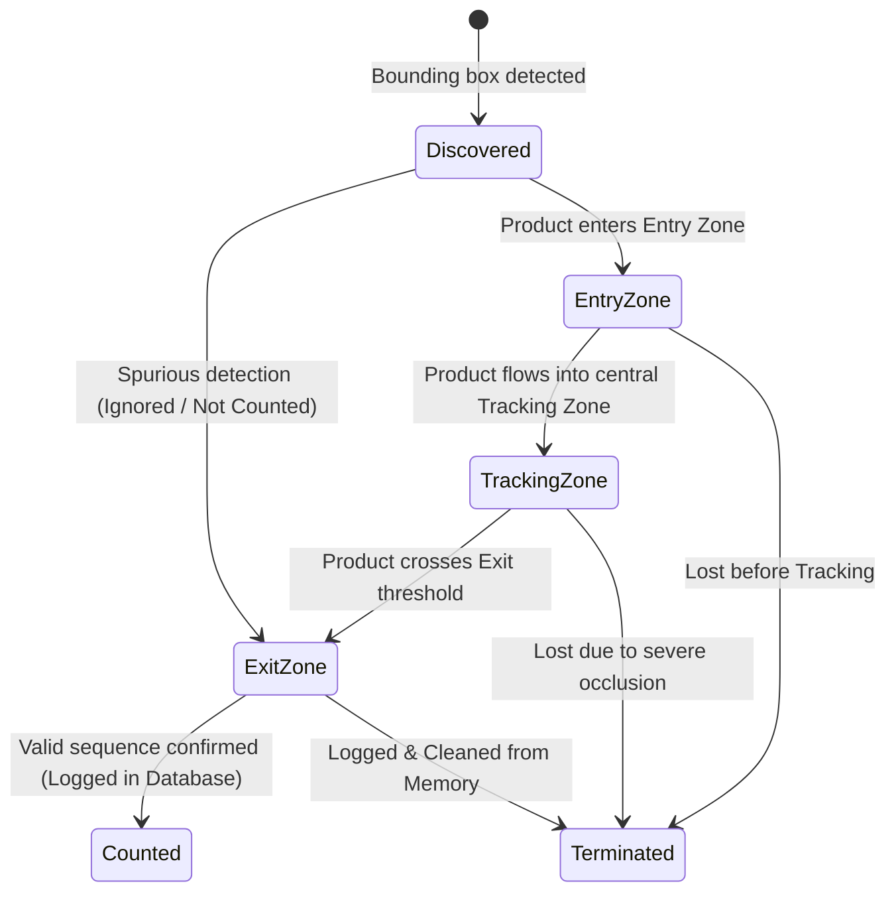

# Phase 3: Multi-Object Tracking and Virtual Counting Zones Logic
**Responsible Lead: Trinh Chan Duy (23120419)**

---

## 📋 Phase Objectives
- Integrate robust Multi-Object Tracking (ByteTrack or DeepSORT) to associate YOLO detections across frames.
- Resolve conveyor challenges: "Double-Counting", "Flickering Omissions", and "ID Switches".
- Design and implement the **Virtual Counting Zones** (Entry $\rightarrow$ Tracking $\rightarrow$ Exit) state machine.

---

## 1. Multi-Object Tracking Engine (ByteTrack vs. DeepSORT)

We will utilize **ByteTrack** as the primary tracking engine due to its superior capability in handling low-score detections (e.g., heavily occluded or blurry products) by associating almost every bounding box instead of discarding low-confidence ones.



### 🧠 Kalman Filter State Representation
The motion of each product is modeled using a Kalman Filter with an 8-dimensional state vector $\mathbf{x}$ and measurement vector $\mathbf{z}$:
$$\mathbf{x} = [x, y, a, h, \dot{x}, \dot{y}, \dot{a}, \dot{h}]^T$$
Where:
- $(x, y)$ is the center bounding box coordinate.
- $a$ is the aspect ratio ($width / height$), $h$ is the height.
- $(\dot{x}, \dot{y}, \dot{a}, \dot{h})$ represent their respective velocities.

---

## 2. Virtual Counting Zones Architecture

Traditional single line-crossing trigger logic is highly vulnerable to camera noise, vibrations, and frame flickering. To mitigate this, we establish three sequential spatial zones across the camera field of view:

```text
======================= CAMERA VIEWPORT =======================
  Conveyor Direction:  ━━━━━━━▶  ━━━━━━━▶  ━━━━━━━▶
==============================================================
|                  |                      |                  |
|   ENTRY ZONE     |    TRACKING ZONE     |    EXIT ZONE     |
|   (Y-coord < Y1) | (Y1 <= Y-coord <= Y2)|  (Y-coord > Y2)  |
|                  |                      |                  |
|                  |   [Product ID: 4]    |                  |
|                  |   Trajectory Tracking|                  |
|                  |   Optimal Viewpoint  |                  |
|                  |   Evaluation         |                  |
|                  |                      |                  |
==============================================================
```

### 🔄 The Zone Transition State Machine
Each unique Product ID is tracked through a transition table. A product is **officially counted** only if it transitions sequentially through all three zones.



---

## 3. Resolving Core Conveyor Challenges

### ⚖️ Double-Counting Mitigation
- **Mechanism**: Once a Track ID reaches the `Counted` state, it is appended to a `Lately_Counted` cache containing the last $N$ unique IDs.
- If a tracked object undergoes an ID switch near the Exit boundary, the system checks its trajectory vector. If it is already in the `Counted` queue or lacks an `EntryZone` history, it is flagged as *duplicate* and ignored.

### 👥 Occlusion Handling (Track Life Management)
- **Max Time-to-Live (`max_age`)**: Set to 30 frames ($1.0$ second at 30 FPS). If a product is momentarily blocked by another object, the Kalman Filter continues to project its location. 
- If the detection reappears within 30 frames near the predicted location, the ID is preserved, preventing an ID switch.

---

## 🗺️ Actionable Task List

- [ ] **Task 2.1**: Set up a modular `src/tracking.py` wrapper for the ByteTrack library.
- [ ] **Task 2.2**: Tune ByteTrack hyperparameters (`track_thresh`, `match_thresh`, `track_buffer`).
- [ ] **Task 2.3**: Write the core state tracker `src/counting.py` representing spatial regions.
- [ ] **Task 2.4**: Implement the spatial coordinate layout boundaries ($Y_1$ and $Y_2$ lines) and allow dynamic calibration.
- [ ] **Task 2.5**: Code the sequential zone checking algorithm (`Entry` $\rightarrow$ `Tracking` $\rightarrow$ `Exit`) state machine.
- [ ] **Task 2.6**: Add secondary direction filters to ensure backward-sliding or vibrating items are not counted twice.
- [ ] **Task 2.7**: Run system-wide counting evaluations on simulated video datasets to verify counting accuracy under dense occlusions.
