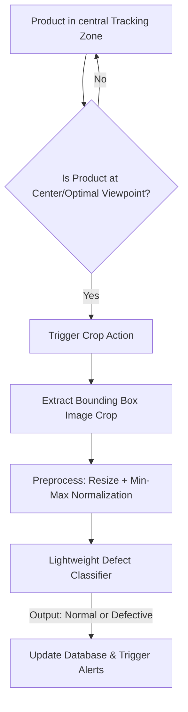
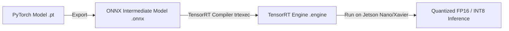

# Phase 4 & 5: Defect Inspection, TensorRT Acceleration, and Edge Deployment
**Responsible Lead: Dang Vo Hong Phuc (23120155)**

---

## 📋 Phase Objectives
- Design the **Optimal Viewpoint Crop** mechanism to capture high-quality product images during tracking.
- Train and deploy a lightweight **Defect Classification Model** to detect shape deformities or label anomalies.
- Compile models using **NVIDIA TensorRT** for edge performance optimization.
- Develop a **Multi-Threaded System Pipeline** and a live **Analytics Dashboard** for plant operators.

---

## 1. Multi-Task Defect Inspection Pipeline

To avoid running defect inspection on every frame (which would waste computation), the system runs **selective defect checks** using tracking trajectory data.



### 📸 Crop Triggering (Optimal Viewpoint Evaluation)
- The center coordinates of the camera viewport represent the minimum lens distortion. 
- When a product's tracklet center $(x, y)$ is closest to the focal axis of the camera, a trigger crops the bounding box from the high-resolution frame.

### 🧠 Defect Classifier Architecture
- **Model Selection**: **MobileNetV3-Small** or **EfficientNet-Lite** (extremely lightweight, ideal for sub-millisecond edge classification).
- **Training dataset**: **MVTec AD (Anomaly Detection)** (simulating metal/plastic surface scratches, cracks) combined with custom label alignment and container deformation samples.

---

## 2. TensorRT Model Acceleration

To deploy the pipeline successfully on Jetson Nano/Xavier, we must convert PyTorch models (`.pt`) to TensorRT engines (`.engine`).



### ⚡ Optimization Specs & Target Benchmarks
- **Quantization**: FP16 (Half Precision) or INT8 (using calibration datasets) to optimize tensor calculations.
- **Dynamic Shapes**: Configured to support flexible batch sizes for multi-camera streams.
- **Performance Targets**:
  - **YOLOv8s/v11m Raw PyTorch**: $\sim 28$ FPS (Jetson Nano)
  - **YOLOv8s/v11m TensorRT FP16**: $> 60$ FPS (Jetson Nano)

---

## 3. Real-Time Multi-Threaded Architecture

To prevent frame dropping and ensure zero-latency video acquisition, the software architecture utilizes a thread-safe multi-queue pipeline:

```text
  ┌──────────────────┐      Queue A      ┌─────────────────────────┐
  │  Capture Thread  ├──────────────────▶│ Detection/Track Thread  │
  │  (RTSP/USB Cam)  │   [Raw Frames]    │  (YOLO + ByteTrack)     │
  └──────────────────┘                   └───────────┬─────────────┘
                                                     │
                                                     │ Queue B [Optimal Crops]
                                                     ▼
  ┌──────────────────┐      Queue C      ┌─────────────────────────┐
  │   GUI / Dash     │◀──────────────────┤ Defect Classifier Thread│
  │ (Streamlit/Web)  │   [State Logs]    │     (MobileNetV3)       │
  └──────────────────┘                   └─────────────────────────┘
```

- **Capture Thread**: Continuously pulls frames from the RTSP/Industrial camera stream, placing them in an bounded FIFO queue.
- **Detection & Tracking Thread**: Consumes raw frames, runs YOLO inference + ByteTrack, updates the spatial state machine, and places optimal viewpoint crops into Queue B.
- **Defect Classifier Thread**: Consumes crops from Queue B, runs classification, and inserts database records.
- **GUI Thread**: Displays the live conveyor feed with overlaid bounding boxes, tracks, status highlights, and current counts.

---

## 4. Real-time Monitoring & Reporting Dashboard

We will develop a fast, elegant **Streamlit-based industrial dashboard** running in a separate process, loading data from an SQLite database/CSV:

- **Key Dashboard Features**:
  - **Conveyor Status Indicators**: Shows live frames-per-second (FPS), frame queues, and camera status.
  - **Visual Counters**: Big widgets showing total counted products, total normal, and total defective.
  - **Defect Alert Log**: Live scrolling alert table showing timestamps, product crop, and anomaly labels.
  - **Analytical Graphs**: Interactive charts showing throughput rates per minute/hour.

---

## 🗺️ Actionable Task List

- [ ] **Task 3.1**: Create `src/defect_classifier.py` and train MobileNetV3 on selected MVTec AD classes.
- [ ] **Task 3.2**: Write optimal crop extraction logic in `src/counting.py` triggered when tracks hit the focal center.
- [ ] **Task 3.3**: Set up ONNX export script `deployment/trt_export.py` for YOLO and MobileNetV3 models.
- [ ] **Task 3.4**: Compile ONNX models into TensorRT engines using `trtexec` with FP16 options.
- [ ] **Task 3.5**: Implement the multi-threaded consumer-producer pattern using Python's `threading` and thread-safe `queue.Queue`.
- [ ] **Task 3.6**: Set up SQLite schema and write basic ingestion utilities to record transaction logs.
- [ ] **Task 3.7**: Develop the analytics dashboard in `dashboard/app.py` using Streamlit or Dash.
- [ ] **Task 3.8**: Perform full system hardware profiling on Edge hardware, noting CPU/GPU usage and overall system FPS.
