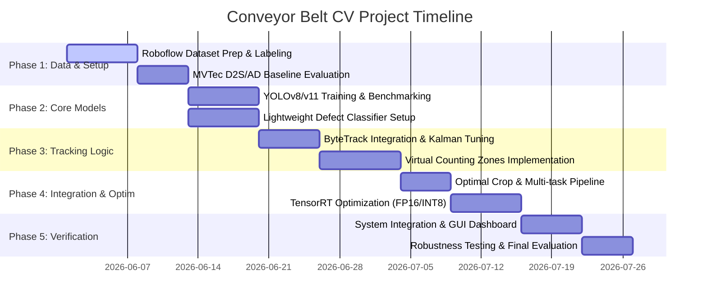

# Project Master Plan: Product Detection, Tracking, and Monitoring System
## Automated Conveyor Belt Computer Vision Pipeline

This directory contains the comprehensive, step-by-step implementation plan for the **Computer Vision System for Automated Product Detection, Tracking, and Monitoring on Manufacturing Conveyor Belts**. This plan is built directly upon the project proposal outlined in [main.tex](file:///home/phuc/Documents/CV/doc/main.tex) and maps out the technical roadmaps, task allocations, and milestones required to successfully finish the project.

---

## 📌 Project Goals & Objectives
1. **Real-time Product Detection**: Deploy a high-accuracy, low-latency object detection model (YOLOv8/v11) to locate products on the conveyor belt.
2. **Robust Multi-Object Tracking**: Track products across frames using state-of-the-art algorithms (ByteTrack/DeepSORT) to assign unique IDs and generate trajectories.
3. **Occlusion & Double-Counting Mitigation**: Implement a custom **Virtual Counting Zones** algorithm (Entry, Tracking, Exit zones) to achieve $>95\%$ counting accuracy under high density.
4. **Real-time Edge Optimization**: Optimize deep learning models using **NVIDIA TensorRT** (FP16/INT8 quantization) to run at $>60$ FPS on Edge AI devices (e.g., Jetson Nano/Xavier).
5. **Multi-Task Defect Inspection**: Extract optimal perspective crops of products during tracking and classify them for structural anomalies (dents, deformities, label misalignments).

---

## 👥 Team & Task Allocation

To ensure parallel development and smooth integration, tasks are divided among team members according to the computer vision pipeline stages:

| Team Member | Role | Primary Responsibilities | Detailed Roadmap |
| :--- | :--- | :--- | :--- |
| **Do Duy Loi**<br>*(23120293)* | **Data & Detection Engineer** | - Dataset acquisition & preprocessing<br>- Roboflow curation & data augmentation<br>- YOLOv8/v11 detection model training & evaluation | [Data & Detection Plan](file:///home/phuc/Documents/CV/source_code/plan/1_data_and_detection.md) |
| **Trinh Chan Duy**<br>*(23120419)* | **Tracking & Counting Architect** | - ByteTrack/DeepSORT integration & tuning<br>- Virtual Counting Zones logic development<br>- Frame-to-frame association & occlusion handling | [Tracking & Counting Plan](file:///home/phuc/Documents/CV/source_code/plan/2_tracking_and_counting.md) |
| **Dang Vo Hong Phuc**<br>*(23120155)* | **Defect Inspection & Deployment Lead** | - Optimal perspective frame extraction<br>- Lightweight defect classifier training<br>- TensorRT optimization & Multi-threaded engine | [Inspection & Deployment Plan](file:///home/phuc/Documents/CV/source_code/plan/3_inspection_and_deployment.md) |

---

## 🛠️ Pipeline Architecture

The complete hardware/software data flow of the system is illustrated below:

```mermaid
graph TD
    %% Source
    A[Industrial Camera / RTSP Stream] -->|Raw Video Frames| B[Multi-Threaded Video Reader]
    
    %% Processing Pipeline
    subgraph Edge AI Processing Pipeline (TensorRT optimized)
        B -->|Frame buffer| C[YOLOv8/v11 Object Detection]
        C -->|Bounding Boxes + Scores| D[ByteTrack/DeepSORT Tracker]
        D -->|Unique IDs + Trajectories| E[Virtual Counting Zones State Machine]
        
        %% Defect Path
        E -->|Optimal Viewpoint Crop Trigger| F[Defect Inspection Classifier]
        F -->|Defect Status: Normal/Defective| G[Database & Alert Manager]
    end
    
    %% Output
    E -->|Valid Counts| H[Real-Time Analytics Dashboard]
    G -->|Alert UI / CSV Logs| H
```

---

## 🗓️ Master Milestones & Timeline



---

## 📂 Implementation Directory Structure

Below is the directory structure we will build in `source_code` to support this modular system:

```text
source_code/
├── plan/                              # Project planning documents
│   ├── README.md                      # Master plan and roadmap (This file)
│   ├── 1_data_and_detection.md        # Dataset processing & YOLO training details
│   ├── 2_tracking_and_counting.md     # Multi-Object tracking & Virtual Zone logic
│   └── 3_inspection_and_deployment.md  # Defect classification, TensorRT & Deployment
│
├── data/                              # Dataset utilities & directories
│   ├── raw/                           # Raw frames from video streams
│   ├── annotated/                     # Roboflow annotated frames (YOLO format)
│   └── processed/                     # Normalized / augmented data
│
├── models/                            # Model definitions, weights & configs
│   ├── detection/                     # YOLO configs & PyTorch/ONNX/TensorRT weights
│   ├── classification/                # Defect classifier weights & exports
│   └── tracker/                       # ByteTrack/DeepSORT configuration files
│
├── src/                               # Main application source code
│   ├── __init__.py
│   ├── detection.py                   # YOLO inference module
│   ├── tracking.py                    # ByteTrack/DeepSORT wrapper
│   ├── counting.py                    # Virtual Counting Zones (Entry/Tracking/Exit) state machine
│   ├── defect_classifier.py           # Crop-and-classify inference module
│   ├── utils/                         # Helper functions (video writing, camera reader, viz)
│   └── app.py                         # Multi-threaded main execution loop & API
│
├── deployment/                        # Edge deployment & compilation utilities
│   ├── trt_export.py                  # ONNX-to-TensorRT engine build script
│   └── requirements.txt               # Software package dependencies
│
└── dashboard/                         # Lightweight monitoring frontend
    └── app.py                         # Streamlit / Web UI for real-time visualization & reporting
```

---

## 🔗 Next Steps & Detail Links

1. To view the data acquisition, labeling, and YOLO training pipeline: **[Read 1_data_and_detection.md](file:///home/phuc/Documents/CV/source_code/plan/1_data_and_detection.md)**
2. To view the tracking system architecture and virtual zone state machine: **[Read 2_tracking_and_counting.md](file:///home/phuc/Documents/CV/source_code/plan/2_tracking_and_counting.md)**
3. To view the defect classifier, TensorRT deployment, and multi-threading engine: **[Read 3_inspection_and_deployment.md](file:///home/phuc/Documents/CV/source_code/plan/3_inspection_and_deployment.md)**
